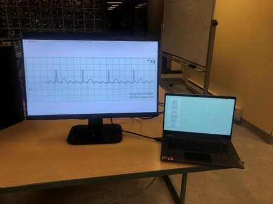
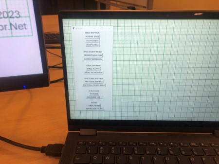

# Introduction
From Thursday March 9th to March 12th, me and some friends enrolled in the 2023 Medical Simulation Hackathon at Queen's University. Our task was to create more accessible training tools for medical students. We noticed that fully capable ECG machines were being used for training students, and we thought we could bring the cost down a lot more by creating an alternative. Introducing our solution, Q-ECGS, which stands for Queen's Electrocardiography Simulator. It works by having one screen utilized by the instructor, where they would select the heart rhythm on a custom GUI to be displayed on another monitor to the trainee. The instructor would be able to assess the trainee based on their response. The advantage of it is that it utilizes any Windows machine capable of running python, and would just need two monitors, brining the cost to entry in training medical students down substantially.

The original script that was presented at the 2023 Medical Simulation Hackathon is contained in the prototype folder and is prototype.py
I did all the coding for the project, but I cannot take all the credit as my other team members did basically everything else, from
sourcing the gifs, to coming up with the actual idea. I have decided to take this up as a bit of a Summer project to improve it past
its prototype phase, and eventually add the networking functionality we always wanted it to include. 

